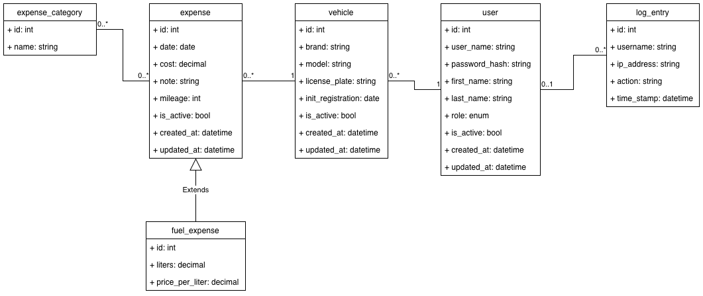
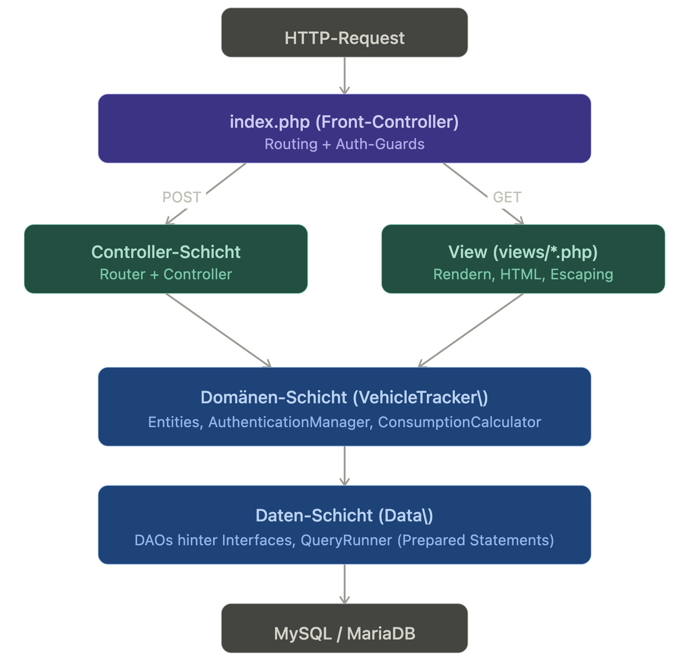

# Fahrzeugkosten-Tracker

Webanwendung zur Erfassung und Auswertung von Fahrzeugkosten: Benutzer verwalten ihre
Fahrzeuge und Ausgaben (inkl. Tankbuchungen für den Durchschnittsverbrauch), kategorisieren
diese und sehen gefilterte Kostenauswertungen; Administratoren können Benutzer deaktivieren.

Die Applikation kann mit folgenden commands einfach gestartet werden:
```bash
ddev start # Container starten; Schema wird automatisch importiert!
ddev launch # Anwendung im Browser öffnen
```
---

## 1. Datenmodell



### 1.1 Entitäten

| Tabelle | Zweck | Wichtige Attribute |
|---|---|---|
| `user` | Benutzerkonto | `user_name` (unique), `password_hash` (bcrypt), `first_name`, `last_name`, `role` (`user`/`admin`), `is_active` |
| `vehicle` | Fahrzeug eines Benutzers | `user_id` (FK), `brand`, `model`, `license_plate`, `init_registration`, `is_active` |
| `expense` | Ausgabe zu einem Fahrzeug | `vehicle_id` (FK), `date`, `cost`, `note`, `mileage`, `is_active`, `is_fuel_expense`, `liters`, `price_per_liter` |
| `expense_category` | Kategorie (zentral gepflegt) | `name` (unique) |
| `expense_category_map` | Zuordnung Ausgabe ↔ Kategorie (m:n) | `expense_id` (FK), `category_id` (FK) – zusammengesetzter PK |
| `log_entry` | Protokoll jeder Benutzeraktion | `user_id` (FK, nullable), `username`, `ip_address`, `action`, `time_stamp` |

### 1.2 Modellierungs-Entscheidungen

- **Soft-Delete** über `is_active` auf `user`, `vehicle` und `expense`. Lesezugriffe
  filtern deshalb mit `is_active = 1`.
- **Single-Table-Inheritance für Ausgaben:** Reguläre Ausgabe und Tankbuchung teilen
  sich die Tabelle `expense`, unterschieden durch das Flag `is_fuel_expense`. Eine
  `CHECK`-Constraint (`chk_fuel_fields`) erzwingt auf DB-Ebene, dass `liters` und
  `price_per_liter` **genau dann** gesetzt sind, wenn `is_fuel_expense = 1`. In PHP
  bildet `FuelExpense extends Expense` diese Unterscheidung ab.
- **Kategorien** werden zentral gepflegt (über die DB) und m:n den Ausgaben zugeordnet.
  Die Spezialkategorie **„Tanken"** macht aus einer Ausgabe eine Tankbuchung.
- **Audit-Log** als eigene Entität, entkoppelt vom Benutzer.

### 1.3 Schema und Testdaten

Schema und Testdaten liegen in [`etc/sql/vehicle-expense-tracker.sql`](../etc/sql/vehicle-expense-tracker.sql)
und werden bei leerer Datenbank automatisch importiert. Alle Testbenutzer haben
das Passwort `test1234`; Benutzer `admin` ist Administrator, Benutzer `inaktiv` ist
deaktiviert (zum Testen der Account-Sperre).

---

## 2. Architektur

### 2.1 Überblick

Alle Objekte werden in [`site/inc/bootstrap.php`](../site/inc/bootstrap.php) per **Dependency Injection** verdrahtet.



### 2.2 Schichten und Namespaces

Der Autoloader in `bootstrap.php` mappt `Foo\Bar` → `site/lib/Foo/Bar.php`.

- **`VehicleTracker\`** – Domänen-Entities und Anwendungslogik.
  Entities (`User`, `Vehicle`, `Expense`, `FuelExpense`, `ExpenseCategory`,
  `LogEntry`) erben von der abstrakten Klasse `Entity` (hält `id`). Anwendungslogik: `AuthenticationManager`, `SessionContext`, `Util`
  (Escaping, Flash-Messages, Old-Input, Datums-/Dezimal-Parsing) sowie die
  Hilfsklassen `ConsumptionCalculator` (l/100 km, Full-to-Full),
  `CategoryColor` (stabile Farbzuordnung), `PagingResult` und `DashboardData`.
- **`VehicleTracker\Controller\`** – POST-Aktions-Controller, nach Domäne
  aufgeteilt. `AbstractController` hält die `$auth`-Abhängigkeit, `requireUser()`
  und den Dispatch-Vertrag (`handles()` / `dispatch()`); `AuthController`,
  `VehicleController`, `ExpenseController`, `AdminController` und
  `ProfileController` erweitern ihn. Der `VehicleOwnership`-Trait liefert die
  geteilte Besitzprüfung; der `Router` leitet eine POST-Aktion an den ersten
  zuständigen Controller weiter.
- **`Data\`** – Persistenz. `DatabaseConnection`, `QueryRunner`
  (Wrapper für Prepared Statements mit expliziter Typbindung – **jeder** SQL-Zugriff
  läuft hierüber) und `Data\Dao\*`, jeweils hinter einem Interface.

### 2.3 Request-Lebenszyklus

`index.php` ist der einzige Einstiegspunkt:

1. **POST zuerst** – Bei einem POST liest `$router->handlePost()` das Feld
   `action`, fragt jeden Controller über `handles()`, ob er zuständig ist, und
   lässt den ersten Treffer `dispatch()` ausführen. Jede Aktion endet in einem
   `Util::redirect()` (**Post/Redirect/Get**, Rückgabetyp `never`).
2. **Mid-Session-Lockout** – Eingeloggte, inzwischen deaktivierte Konten werden bei
   jedem Request sofort abgemeldet (Deaktivierung wirkt unmittelbar).
3. **View-Auflösung** – `$_GET['view']` wird gegen drei Whitelists geprüft
   (`$publicViews`, `$protectedViews`, `$adminViews`); alles Unbekannte fällt auf
   einen sicheren Default zurück.
4. **Auth-Guards** – eingeloggte Benutzer werden von Login/Register redirected und
anonyme von geschützten Views weggeleitet; Admin-Views erfordern die Admin-Rolle.
5. **Rendern** – Views (`views/<view>.php`) werden eingebunden.

### 2.4 Authentifizierung & Sessions

- `SessionContext` besitzt den Session-Lebenszyklus und ausschließlich den
  Benutzer-ID-Slot in `$_SESSION`.
- `AuthenticationManager` ist die öffentliche Auth-API. Passwörter werden mit
  `password_hash`/`password_verify` (bcrypt) verarbeitet; bei der Anmeldung wird
  `is_active` geprüft, und jeder Auth-Ausgang wird protokolliert. `getCurrentUser()`
  lädt den Benutzer bei jedem Aufruf frisch aus der DB, damit Deaktivierungen sofort greifen.

### 2.5 Sicherheit

- **SQL-Injection:** Alle Datenbankzugriffe laufen über `QueryRunner` mit Prepared
  Statements und gebundenen Parametern. Kein String wird in SQL interpoliert.
- **XSS:** Jeder dynamische Wert in einer View wird durch `Util::escape()`
  (`htmlspecialchars`, `ENT_QUOTES`, UTF-8) ausgegeben.
- **Serverseitige Validierung** in den Controllern (Pflichtfelder, Beträge > 0,
  Datum nicht in der Zukunft, Notizlänge, gültige Kategorie-IDs gegen die DB geprüft).
- **Autorisierung:** Besitzprüfung bei jeder verändernden Aktion (ein Benutzer kann
  nur eigene Fahrzeuge/Ausgaben bearbeiten); Rollenprüfung für den Admin-Bereich.

---

## 3. Testfälle

Die dokumentierten Testfälle befinden sich in [test_documentation.md](test_documentation.md).
