# Testdokumentation – Fahrzeugkosten-Tracker

Dokumentation der manuell durchgeführten Testfälle. Abgedeckt werden die in der Angabe
geforderten Zustände: **Benutzerlogin der unterschiedlichen Rollen inkl. Fehlerbehandlung**,
**Darstellung aus Sicht der unterschiedlichen Rollen inkl. Status** sowie **alle elementaren
CRUD-Operationen** – einschließlich **fehlerhafter Eingaben**.

## Testumgebung

- Start: `ddev start` (Schema + Testdaten werden automatisch importiert), `ddev launch`
- Browser, Standard-DDEV-Installation

## Testbenutzer

| Benutzername | Passwort | Rolle | Status |
|---|---|---|---|
| `admin` | `test1234` | Administrator | aktiv |
| `maxmuster` | `test1234` | Benutzer | aktiv |
| `erikamuster` | `test1234` | Benutzer | aktiv |
| `inaktiv` | `test1234` | Benutzer | deaktiviert |

---

## 1. Login & Authentifizierung

### TC-01 – Login als Benutzer (erfolgreich)
- **Vorbedingung:** abgemeldet
- **Schritte:** Login-Seite öffnen → `maxmuster` / `test1234` → „Anmelden"
- **Erwartet:** Weiterleitung zur Übersicht, Benutzername in der Topbar sichtbar
- **Status:** ✅ bestanden

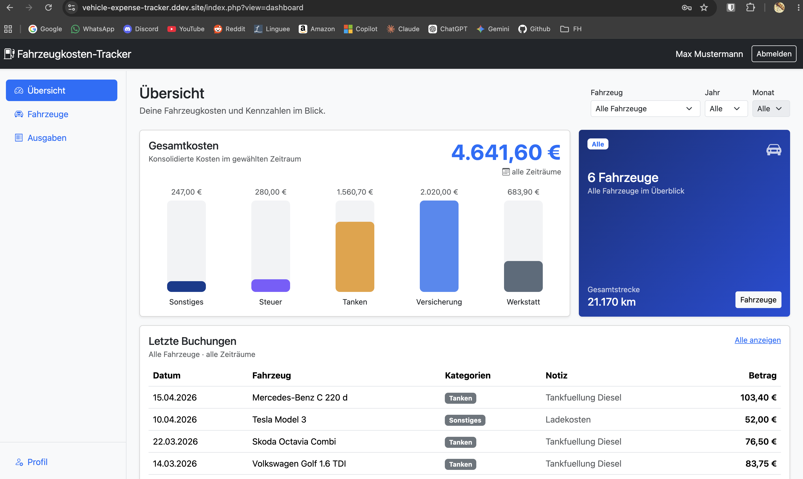

### TC-02 – Registrierung (erfolgreich)
- **Vorbedingung:** abgemeldet
- **Schritte:** Registrierung öffnen → neuen Benutzernamen, Vor-/Nachname und ein Passwort
  (≥ 8 Zeichen, Bestätigung identisch) eingeben → „Registrieren"
- **Erwartet:** Weiterleitung zur Login-Seite mit Erfolgsmeldung „Registrierung erfolgreich.
  Du kannst dich jetzt anmelden."; das neue Konto kann sich anschließend anmelden
- **Status:** ✅ bestanden

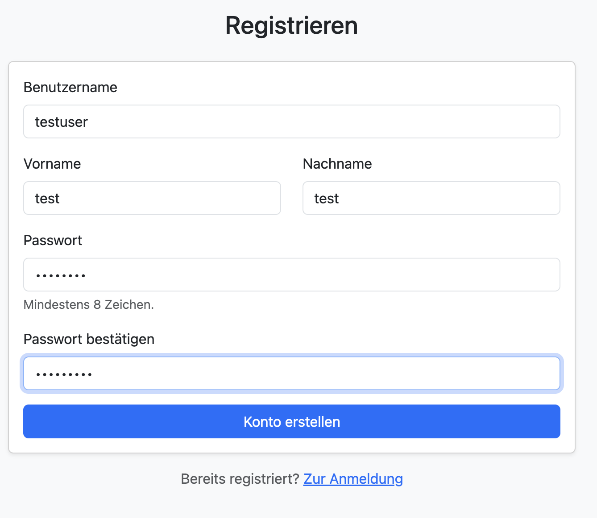
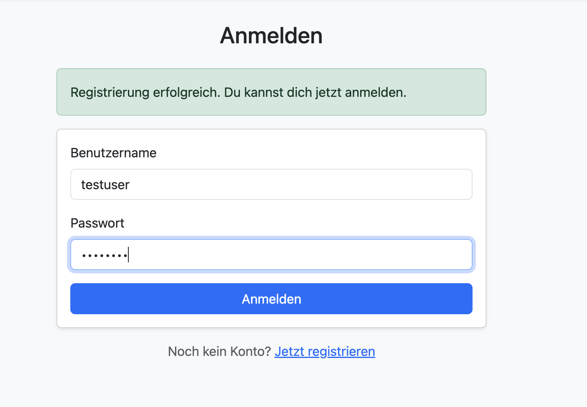
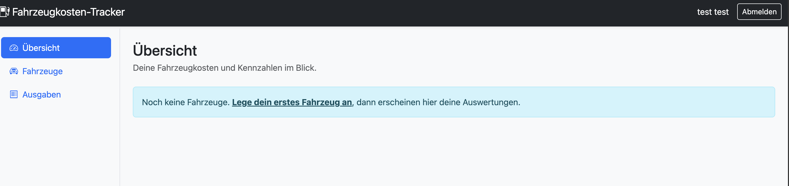

### TC-03 – Login mit falschem Passwort (Fehlerbehandlung)
- **Vorbedingung:** abgemeldet
- **Schritte:** `maxmuster` / `falsch123` → „Anmelden"
- **Erwartet:** Anmeldung verweigert, allgemeine Fehlermeldung (kein Hinweis, ob Benutzer
  oder Passwort falsch war), kein Login
- **Status:** ✅ bestanden

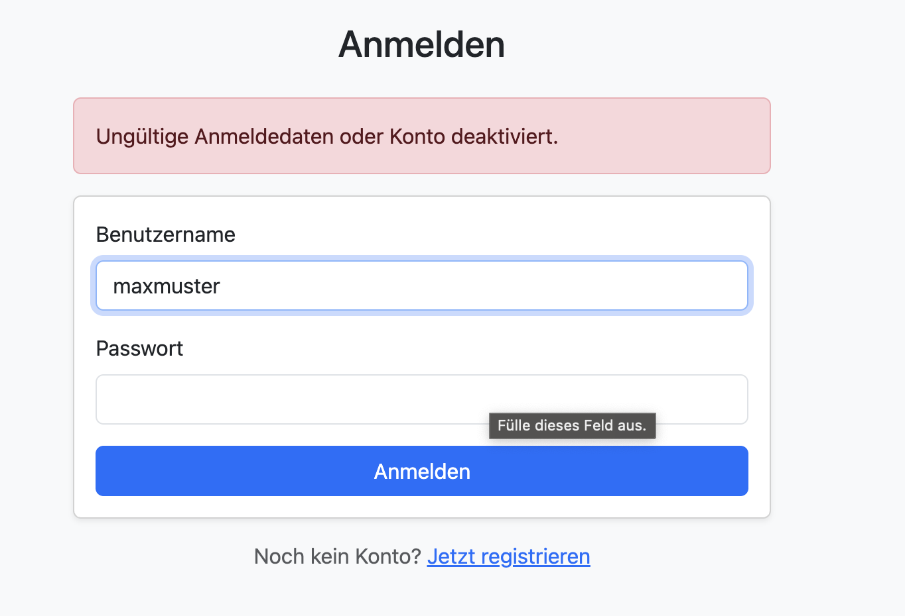

### TC-04 – Login mit deaktiviertem Konto
- **Vorbedingung:** abgemeldet
- **Schritte:** `inaktiv` / `test1234` → „Anmelden"
- **Erwartet:** Anmeldung verweigert mit Hinweis, dass das Konto deaktiviert ist
- **Status:** ✅ bestanden

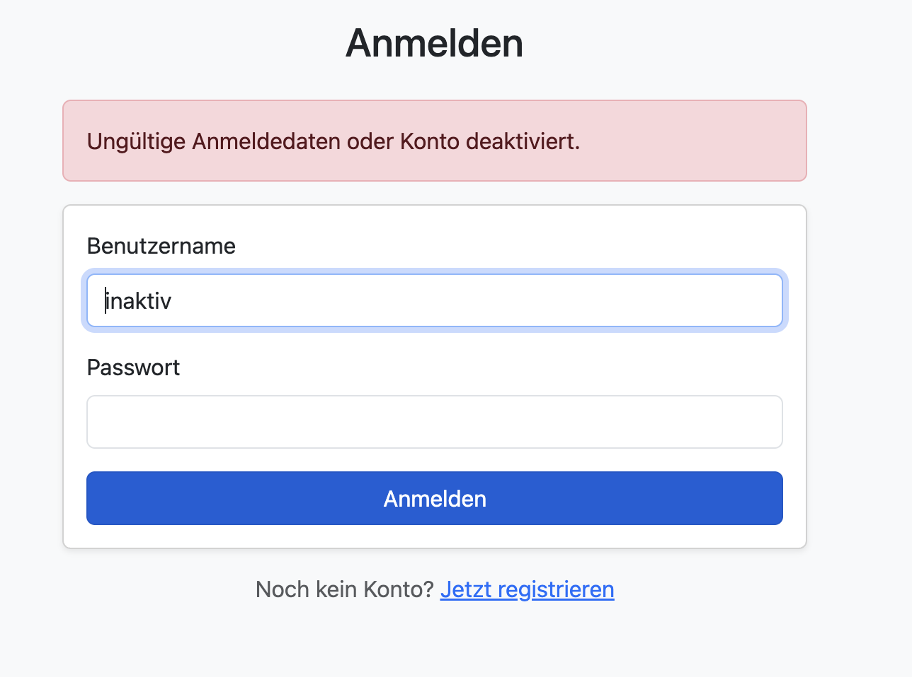

### TC-05 – Registrierung mit fehlerhafter Eingabe
- **Vorbedingung:** abgemeldet
- **Schritte:** Registrierung öffnen → mit bereits vergebenem Benutzernamen `maxmuster`,
  ungleichen Passwörtern oder Passwort < 8 Zeichen absenden
- **Erwartet:** Fehlermeldung, kein Konto angelegt, Eingaben (außer Passwort) bleiben erhalten
- **Status:** ✅ bestanden

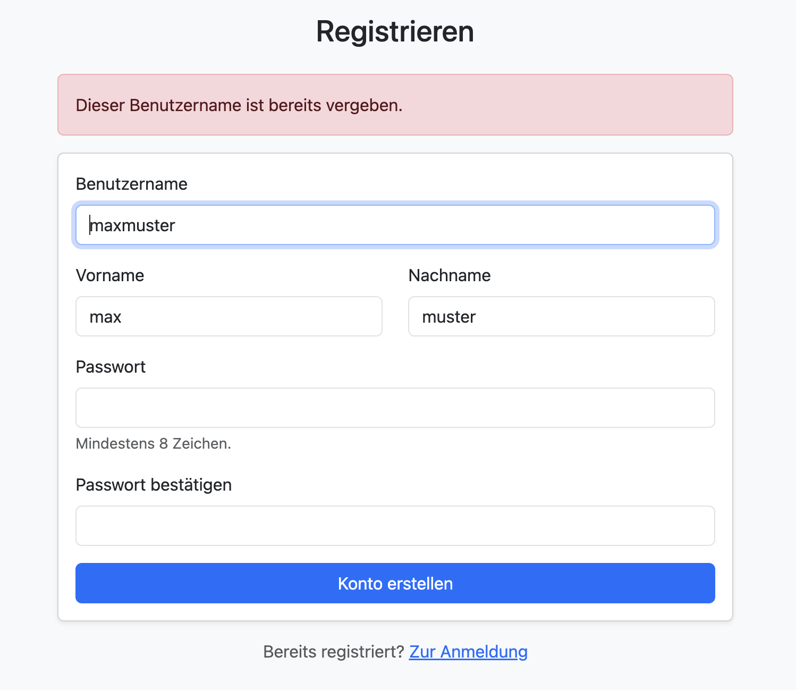

---

## 2. Rollensicht & Zugriffsschutz

### TC-06 – Anonymer Besucher ruft geschützte Seite auf
- **Vorbedingung:** abgemeldet
- **Schritte:** geschützte URL direkt aufrufen, z. B. `index.php?view=vehicles`
- **Erwartet:** Weiterleitung zur Login-Seite (kein Zugriff ohne Anmeldung)
- **Status:** ✅ bestanden

### TC-07 – Benutzer-Sicht (ohne Admin-Bereich)
- **Vorbedingung:** als `maxmuster` angemeldet
- **Schritte:** Navigation betrachten
- **Erwartet:** kein Menüpunkt **Administration**; direkter Aufruf von
  `index.php?view=admin` wird unterbunden/weitergeleitet
- **Status:** ✅ bestanden

### TC-08 – Admin-Sicht (Benutzerverwaltung inkl. Status)
- **Vorbedingung:** als `admin` angemeldet
- **Schritte:** **Administration** öffnen
- **Erwartet:** Liste aller Benutzer mit Rolle und aktiv/deaktiviert-Status
- **Status:** ✅ bestanden

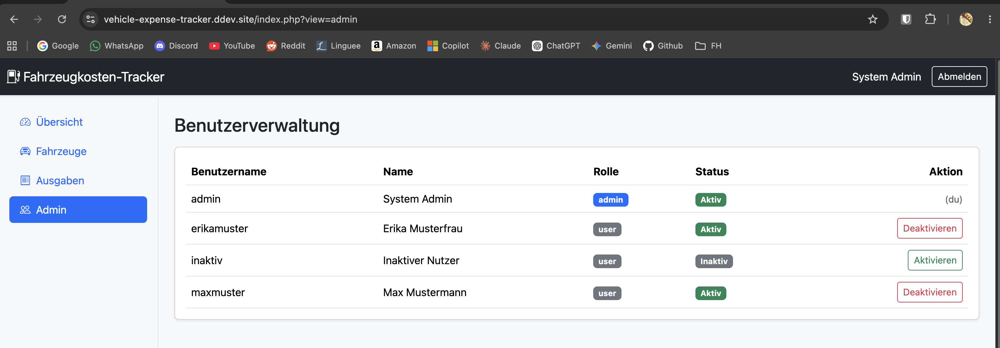

---

## 3. CRUD – Fahrzeuge

### TC-09 – Fahrzeug anlegen (Create)
- **Vorbedingung:** als `maxmuster` angemeldet
- **Schritte:** Fahrzeuge → „Fahrzeug hinzufügen" → Marke/Modell/Kennzeichen/Erstzulassung
  ausfüllen → speichern
- **Erwartet:** neues Fahrzeug erscheint in der Liste, Erfolgsmeldung
- **Status:** ✅ bestanden

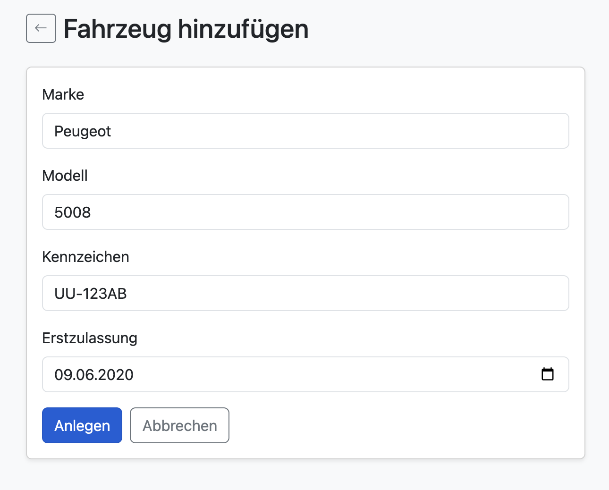
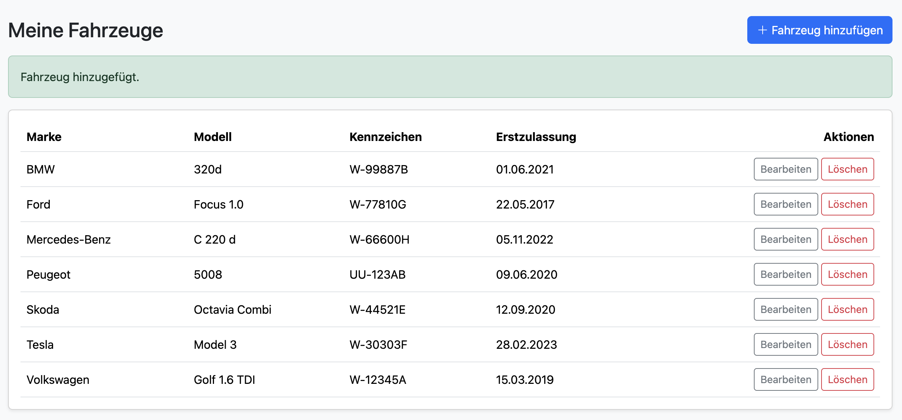

### TC-10 – Fahrzeug mit ungültiger Eingabe (fehlerhafte Eingabe)
- **Vorbedingung:** Fahrzeugformular geöffnet
- **Schritte:** Pflichtfelder leer lassen bzw. ungültiges Erstzulassungsdatum → speichern
- **Erwartet:** Validierungsfehler, kein Datensatz angelegt, Eingaben bleiben erhalten
- **Status:** ✅ bestanden

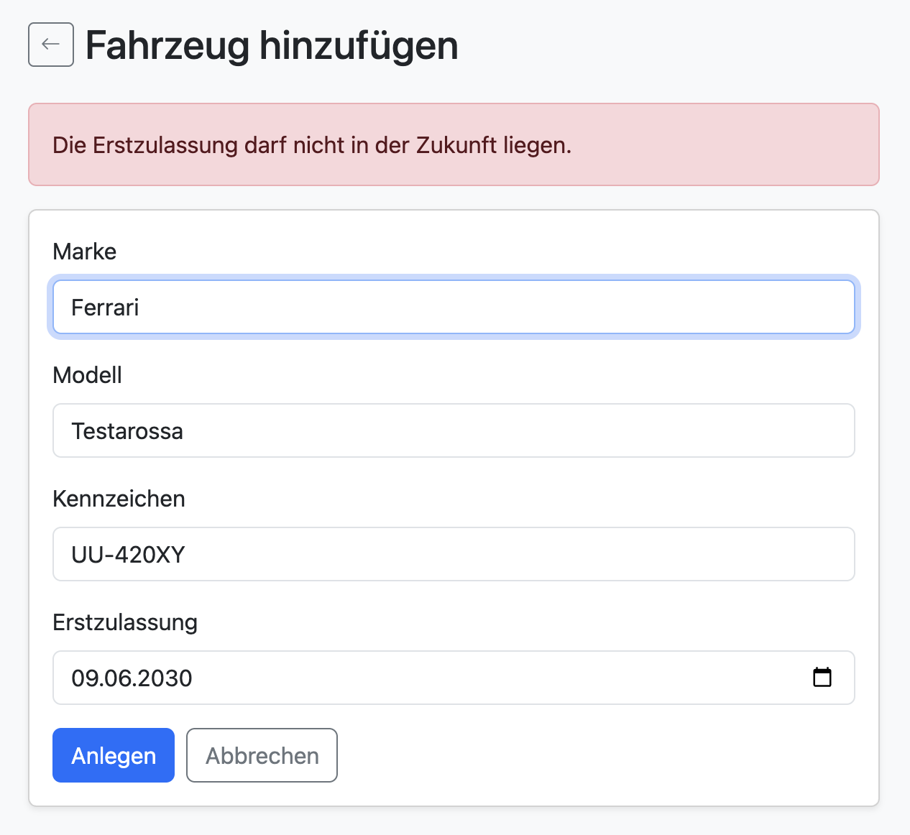

### TC-11 – Fahrzeug bearbeiten (Update)
- **Vorbedingung:** mindestens ein Fahrzeug vorhanden
- **Schritte:** bei einem Fahrzeug „Bearbeiten" → Wert ändern → speichern
- **Erwartet:** geänderter Wert in der Liste sichtbar, Erfolgsmeldung
- **Status:** ✅ bestanden

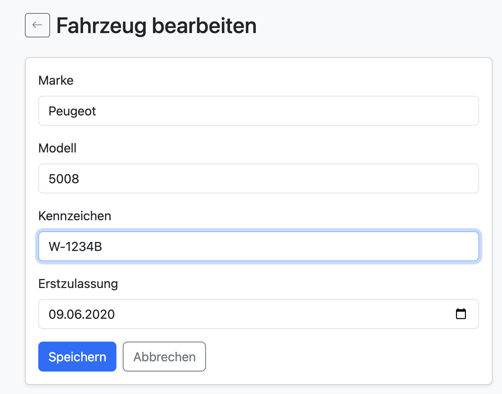
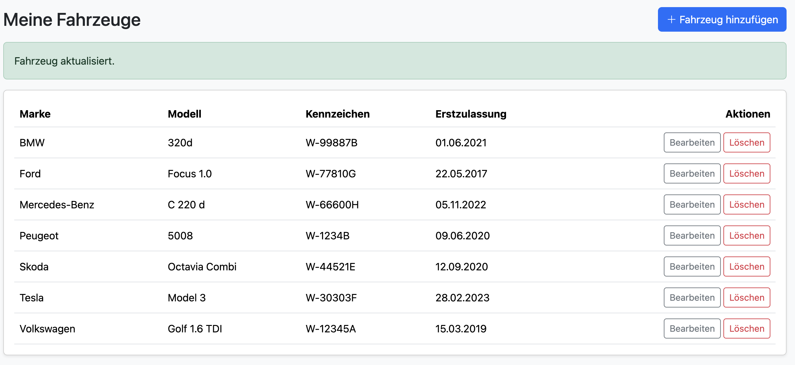

### TC-12 – Fahrzeug löschen (Delete / Soft-Delete)
- **Vorbedingung:** mindestens ein Fahrzeug vorhanden
- **Schritte:** „Löschen" → bestätigen
- **Erwartet:** Fahrzeug verschwindet aus der Liste (Soft-Delete, nicht physisch gelöscht)
- **Status:** ✅ bestanden

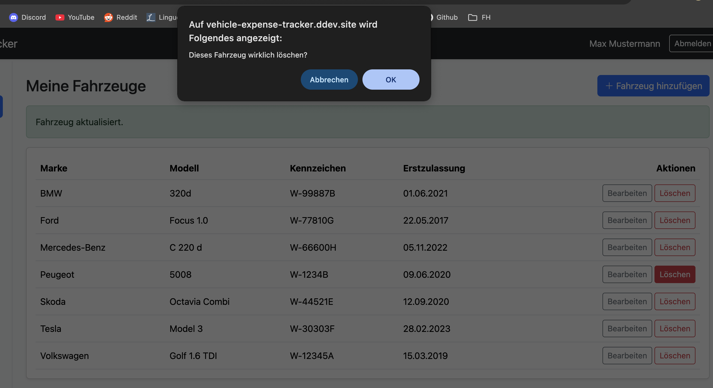
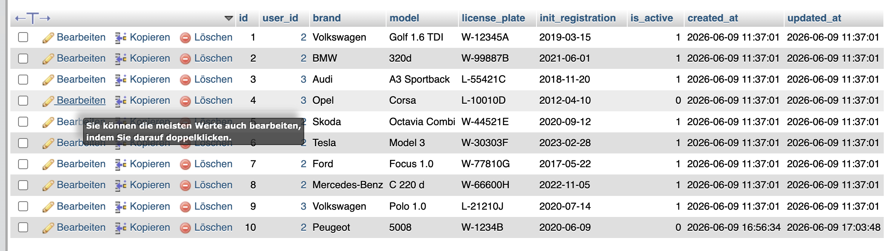

---

## 4. CRUD – Ausgaben & Tankbuchungen

### TC-13 – Ausgabe anlegen mit Kategorie (Create)
- **Vorbedingung:** als `maxmuster` angemeldet, Fahrzeug vorhanden
- **Schritte:** Ausgaben → „Buchung hinzufügen" → Fahrzeug, Datum, Betrag, Kategorie
  (z. B. `Werkstatt`) → speichern
- **Erwartet:** Buchung erscheint in der Liste mit Kategorie-Badge, Erfolgsmeldung
- **Status:** ✅ bestanden

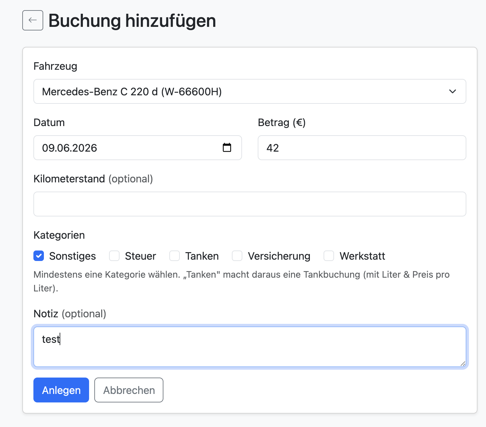
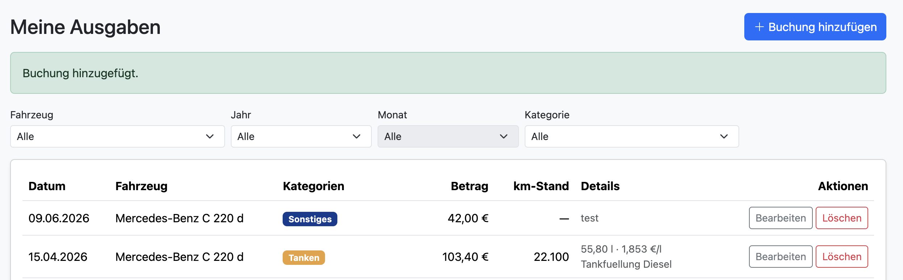

### TC-14 – Tankbuchung anlegen (Spezialfall)
- **Vorbedingung:** Buchungsformular geöffnet
- **Schritte:** Kategorie **`Tanken`** wählen → die Felder **Liter** und **Preis/Liter**
  erscheinen → ausfüllen, Kilometerstand setzen → speichern
- **Erwartet:** Tankbuchung wird angelegt; fließt in den Durchschnittsverbrauch der
  Übersicht ein
- **Status:** ✅ bestanden

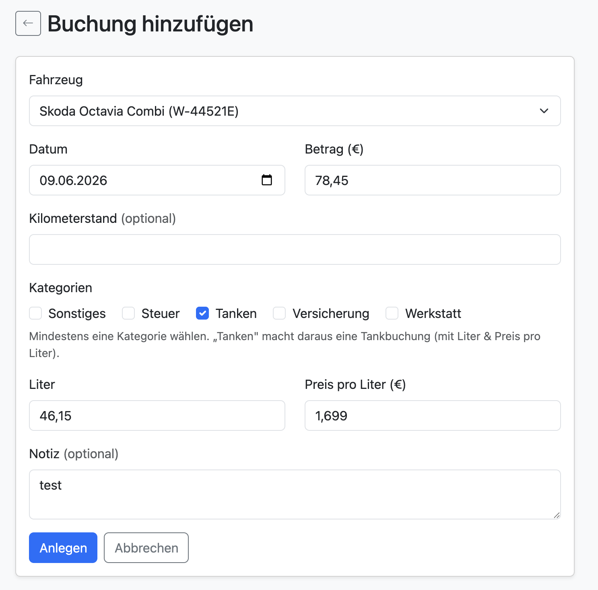
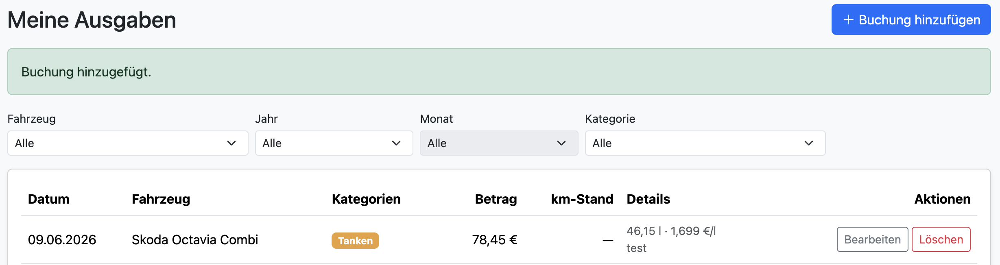

### TC-15 – Ausgabe mit ungültiger Eingabe (fehlerhafte Eingabe)
- **Vorbedingung:** Buchungsformular geöffnet
- **Schritte:** Betrag `0` oder negativ, Datum in der Zukunft, keine Kategorie → speichern
- **Erwartet:** Validierungsfehler (Betrag > 0, Datum nicht in der Zukunft, mindestens
  eine Kategorie); kein Datensatz angelegt
- **Status:** ✅ bestanden

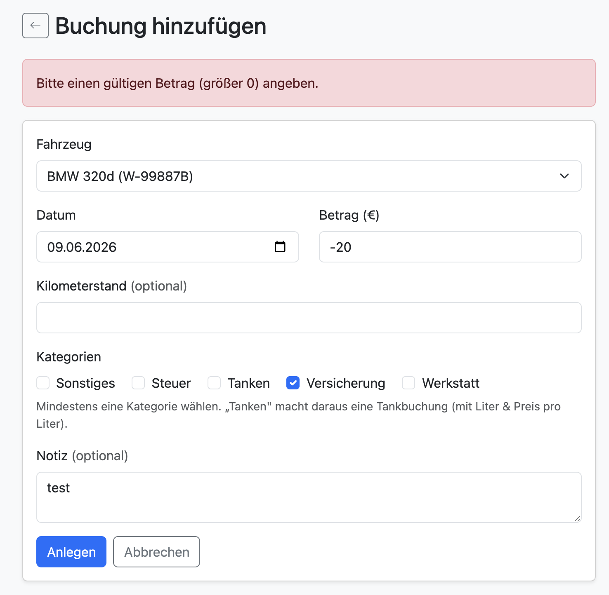

### TC-16 – Ausgabe bearbeiten (Update)
- **Vorbedingung:** mindestens eine Buchung vorhanden
- **Schritte:** „Bearbeiten" → Betrag/Notiz ändern → speichern
- **Erwartet:** geänderte Werte in der Liste, Erfolgsmeldung
- **Status:** ✅ bestanden

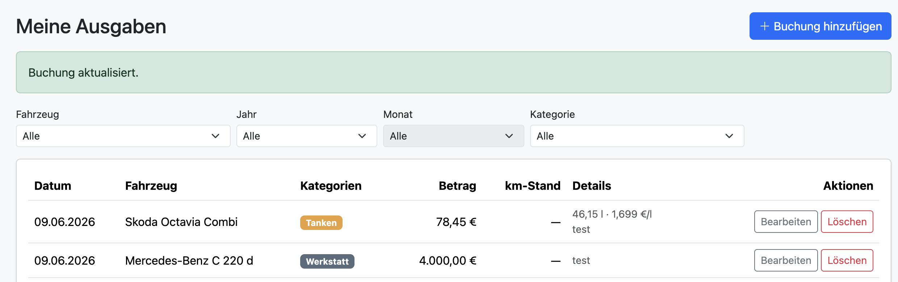

### TC-17 – Ausgabe löschen (Delete)
- **Vorbedingung:** mindestens eine Buchung vorhanden
- **Schritte:** „Löschen" → bestätigen
- **Erwartet:** Buchung verschwindet aus der Liste (Soft-Delete)
- **Status:** ✅ bestanden

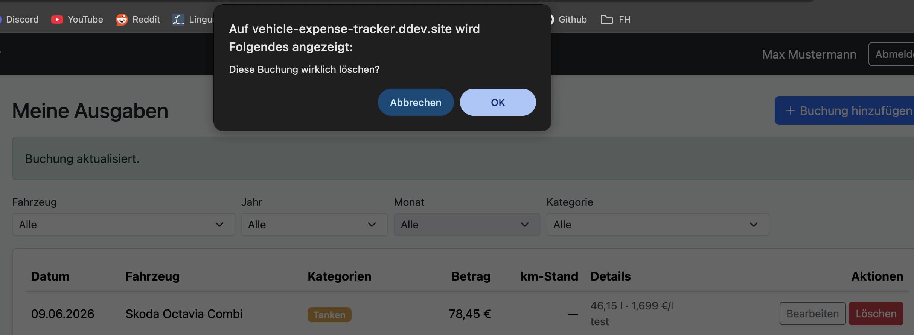
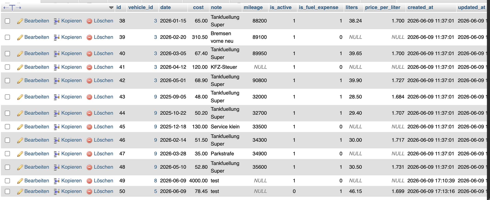

---

## 5. Auswertung & Admin-Aktion

### TC-18 – Übersicht / Auswertung mit Filter
- **Vorbedingung:** als `maxmuster` angemeldet (Benutzer mit Buchungen)
- **Schritte:** Übersicht öffnen → nach Fahrzeug, Jahr und Monat filtern
- **Erwartet:** Gesamtkosten, Kategorie-Diagramm und Kennzahlen (Ø Verbrauch, Kosten/km)
  aktualisieren sich entsprechend dem Filter
- **Status:** ✅ bestanden

### TC-19 – Admin deaktiviert Benutzer (Statuswechsel wirkt sofort)
- **Vorbedingung:** als `admin` angemeldet
- **Schritte:** Administration → Benutzer `erikamuster` deaktivieren; anschließend als
  `erikamuster` anmelden bzw. eine bestehende Sitzung weiterverwenden
- **Erwartet:** Status wechselt auf „deaktiviert"; `erikamuster` kann sich nicht mehr
  anmelden und wird bei aktiver Sitzung beim nächsten Request abgemeldet. Admin kann sich
  nicht selbst deaktivieren.
- **Status:** ✅ bestanden

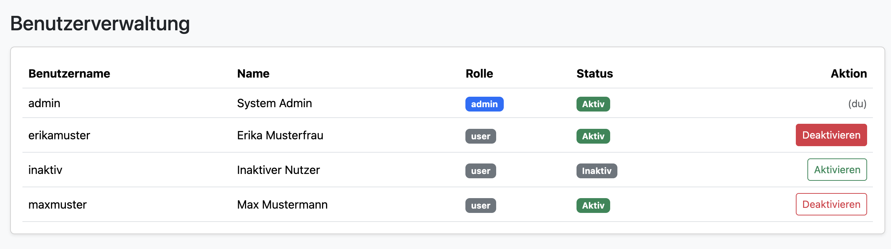
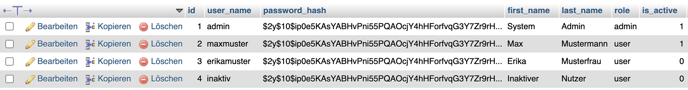
